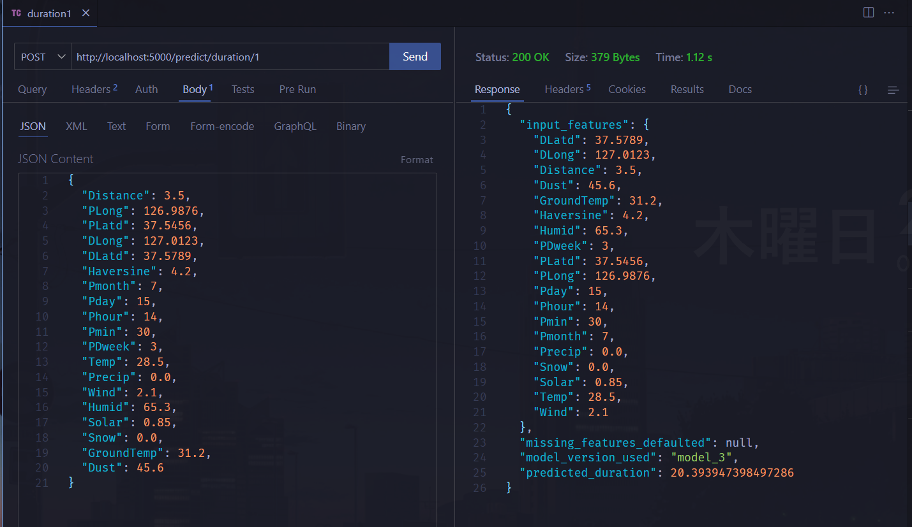
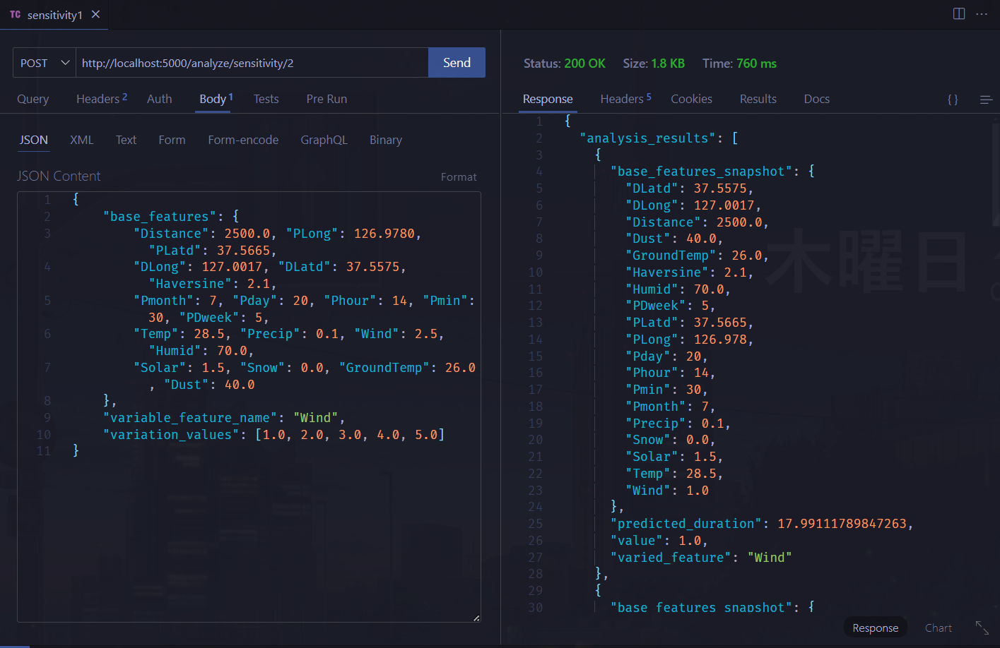
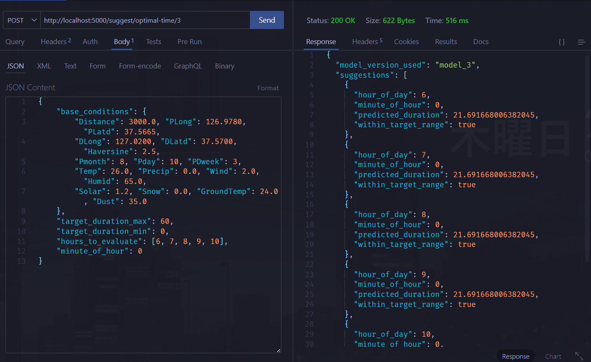

# Project Big Data 2 - Kafka PySpark (Endpoints)

|Nama | NRP |
|---|---|
|Nathan Kho Pancras|5027231002|
|Rafael Ega Krisaditya|5027231025|
|Fico Simhanandi|5027231030|

## Request JSON

### 1. Predict Duration Endpoint (`/predict/duration/<model_version_num>`)

```json
{
  "Distance": 3.5,
  "PLong": 126.9876,
  "PLatd": 37.5456,
  "DLong": 127.0123,
  "DLatd": 37.5789,
  "Haversine": 4.2,
  "Pmonth": 7,
  "Pday": 15,
  "Phour": 14,
  "Pmin": 30,
  "PDweek": 3,
  "Temp": 28.5,
  "Precip": 0.0,
  "Wind": 2.1,
  "Humid": 65.3,
  "Solar": 0.85,
  "Snow": 0.0,
  "GroundTemp": 31.2,
  "Dust": 45.6
}
```



### 2. Sensitivity Analysis Endpoint (`/analyze/sensitivity/<model_version_num>`)

```json
{
  "base_features": {
    "Distance": 3.5,
    "PLong": 126.9876,
    "PLatd": 37.5456,
    "DLong": 127.0123,
    "DLatd": 37.5789,
    "Haversine": 4.2,
    "Pmonth": 7,
    "Pday": 15,
    "Phour": 14,
    "Pmin": 30,
    "PDweek": 3,
    "Temp": 28.5,
    "Precip": 0.0,
    "Wind": 2.1,
    "Humid": 65.3,
    "Solar": 0.85,
    "Snow": 0.0,
    "GroundTemp": 31.2,
    "Dust": 45.6
  },
  "variable_feature_name": "Distance",
  "variation_values": [1.0, 2.0, 3.0, 4.0, 5.0]
}
```



### 3. Optimal Time Suggestion Endpoint (`/suggest/optimal-time/<model_version_num>`)

```json
{
  "base_conditions": {
    "Distance": 3.5,
    "PLong": 126.9876,
    "PLatd": 37.5456,
    "DLong": 127.0123,
    "DLatd": 37.5789,
    "Haversine": 4.2,
    "Pmonth": 7,
    "Pday": 15,
    "PDweek": 3,
    "Temp": 28.5,
    "Precip": 0.0,
    "Wind": 2.1,
    "Humid": 65.3,
    "Solar": 0.85,
    "Snow": 0.0,
    "GroundTemp": 31.2,
    "Dust": 45.6
  },
  "target_duration_max": 20.0,
  "target_duration_min": 5.0,
  "hours_to_evaluate": [7, 8, 9, 10, 11, 12, 13, 14, 15, 16, 17, 18],
  "minute_of_hour": 30
}
```

